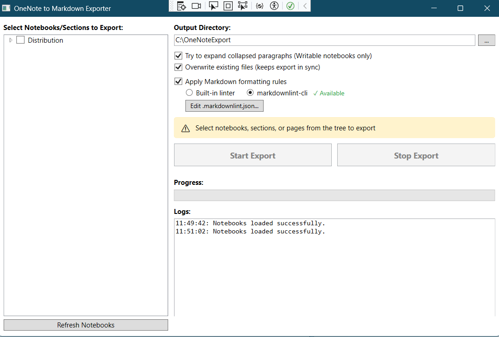

# OneNote to Markdown Exporter

A Windows desktop application that exports Microsoft OneNote notebooks, sections, and pages to Markdown format. Built with C#, [WPF](https://learn.microsoft.com/en-us/dotnet/desktop/wpf/overview/), and [COM Interop](https://learn.microsoft.com/en-us/dotnet/standard/native-interop/cominterop). No [Azure App Registration (Service Principals)](https://learn.microsoft.com/en-us/entra/identity-platform/quickstart-register-app), no cloud authentication, no admin consent required. Just you and your notes.



## Download

Go to [GitHub Releases](https://github.com/segunak/one-note-to-markdown/releases) to download the latest version.

1. Download the `.zip` file from the latest release
2. Extract the folder (it contains the `.exe` and a `resources` folder)
3. Run `OneNoteMarkdownExporter.exe`

> **Important:** Keep the `resources` folder in the same directory as the `.exe`. It contains the bundled Node.js runtime and markdownlint-cli needed for Markdown linting.

## Requirements

- **Windows 10 or 11**
- **Microsoft OneNote** (the desktop app that comes with Microsoft 365/Office 365, not the old "OneNote for Windows 10" app which [reached end of support in October 2025](https://support.microsoft.com/en-us/office/what-is-happening-to-onenote-for-windows-10-2b453bfe-66bc-4ab2-9118-01e7eb54d2d6))

> **Which OneNote do I have?** If you installed OneNote through Microsoft 365 or Office 365, you have the right one. The desktop app uses COM Interop, which this tool relies on. If you're unsure, open OneNote, go to **File > Account**, and you should see "Microsoft 365" or your Office subscription info. [More details on OneNote versions here](https://support.microsoft.com/en-us/office/what-s-the-difference-between-the-onenote-versions-a624e692-b78b-4c09-b07f-46181958118f).

## Features

- **Two ways to run** - GUI for interactive use, CLI for scripting and automation
- **Tree view selection** - Pick entire notebooks, specific sections, or individual pages
- **Clean Markdown output** - Proper formatting, no leftover HTML tags
- **Image extraction** - Embedded images saved to an `assets` folder with relative paths
- **Sync-friendly** - "Overwrite existing files" option keeps exports in sync with your notes
- **Markdown linting** - Automatic cleanup via bundled markdownlint-cli (configurable)

## Usage

This tool supports both **GUI mode** and **CLI mode**:

| Mode | How to Launch | Best For |
|------|---------------|----------|
| **GUI** | Double-click the `.exe` or run without arguments | Interactive use, exploring notebooks, one-time exports |
| **CLI** | Run with command-line arguments | Scripting, automation, scheduled tasks, AI tool integration |

The app automatically detects which mode to use based on whether you pass command-line arguments.

## GUI Mode

Double-click `OneNoteMarkdownExporter.exe` to launch the graphical interface.

### Steps

1. **Launch the app** - OneNote will open automatically if it's not running
2. **Select your content** - Check the boxes next to notebooks, sections, or pages
3. **Choose an output directory** - Defaults to `Downloads\OneNoteExport`
4. **Configure options**:
   - **Overwrite existing files** - Enable this for ongoing syncing
   - **Apply Markdown linting** - Cleans up the output (can be toggled off)
5. **Click Start Export**

## CLI Mode

Run with command-line arguments for scripting, automation, scheduled tasks, etc. The app runs headlessly without opening the GUI.

```powershell
# Export all notebooks
OneNoteMarkdownExporter.exe --all

# Export a specific notebook
OneNoteMarkdownExporter.exe --notebook "Work Notes"

# Export to a custom directory
OneNoteMarkdownExporter.exe --all --output "C:\MyExports"

# Show help
OneNoteMarkdownExporter.exe --help
```

### CLI Parameters

#### Selection (at least one required)

| Option | Description |
|--------|-------------|
| `--all` | Export all notebooks |
| `--notebook <name>` | Export specific notebook by name |
| `--section <path>` | Export section by path, e.g., `"Notebook/Section"` |
| `--page <id>` | Export page by OneNote ID |

#### Output

| Option | Description |
|--------|-------------|
| `--output`, `-o` `<path>` | Output directory (default: `Downloads\OneNoteExport`) |
| `--overwrite` | Overwrite existing files instead of creating numbered copies |

#### Linting

| Option | Description |
|--------|-------------|
| `--no-lint` | Disable Markdown linting (markdownlint-cli) |
| `--lint-config <path>` | Path to custom `.markdownlint.json` configuration file |

#### Utility

| Option | Description |
|--------|-------------|
| `--list` | List all notebooks, sections, and pages (no export) |
| `--dry-run` | Preview what would be exported without creating files |
| `--verbose`, `-v` | Show detailed output including file paths |
| `--quiet`, `-q` | Show only errors (suppress progress messages) |
| `--help`, `-h` | Show help and usage information |

### CLI Examples

```powershell
# List all notebooks and their structure
OneNoteMarkdownExporter.exe --list

# List with verbose mode to see page IDs
OneNoteMarkdownExporter.exe --list --verbose

# Preview what would be exported (no files created)
OneNoteMarkdownExporter.exe --notebook "Personal" --dry-run

# Export multiple notebooks
OneNoteMarkdownExporter.exe --notebook "Work" --notebook "Personal"

# Export a specific section within a notebook
OneNoteMarkdownExporter.exe --section "Work Notes/Meeting Notes"

# Export everything, overwrite existing, skip linting
OneNoteMarkdownExporter.exe --all --overwrite --no-lint

# Quiet mode for scheduled tasks (only shows errors)
OneNoteMarkdownExporter.exe --all --quiet --overwrite

# Full verbose export to custom location
OneNoteMarkdownExporter.exe --all --output "D:\Backups\OneNote" --verbose --overwrite
```

## Markdown Linting

The app uses [markdownlint-cli](https://github.com/DavidAnson/markdownlint-cli) for Markdown linting. Node.js and all dependencies are bundled, so it works out of the box with no additional setup.

- **Enabled by default** - Can be toggled off in the UI or with `--no-lint` in CLI
- **Non-blocking** - If linting fails, the error is logged and export continues with the unlinted content
- **Configurable** - Edit `.markdownlint.json` to customize rules

### Configuration

Click "Edit .markdownlint.json..." in the UI or find the file in the `resources` folder. The default configuration:

```json
{
  "default": true,
  "MD013": false,
  "MD033": false,
  "MD028": false,
  "MD012": false,
  "MD040": false,
  "MD024": false,
  "MD018": false,
  "MD036": false,
  "MD049": false,
  "MD041": false
}
```

| Rule | What It Does | Why It's Disabled |
|------|--------------|-------------------|
| **MD013** | Line length limit (80 chars) | OneNote content doesn't follow line limits |
| **MD033** | No inline HTML | Some exported content may have intentional HTML |
| **MD041** | First line should be H1 | Not all notes start with a heading |
| **MD024** | No duplicate headings | Notes often reuse section headers |
| **MD028** | Blank line inside blockquote | Common in formatted quotes |
| **MD012** | Multiple blank lines | OneNote spacing doesn't always translate cleanly |
| **MD040** | Fenced code blocks need language | Not all code blocks have a language |
| **MD018** | No space after hash in heading | Edge cases in conversion |
| **MD036** | Emphasis instead of heading | Style choice |
| **MD049** | Consistent emphasis style | Mixed styles in source content |

## Technical Details

### How It Works

1. **Connect to OneNote** via COM Interop (`Microsoft.Office.Interop.OneNote`)
2. **Enumerate hierarchy** using [`GetHierarchy()`](https://learn.microsoft.com/en-us/office/client-developer/onenote/application-interface-onenote#gethierarchy-method) to build the notebook/section/page tree
3. **Export pages** using [`GetPageContent()`](https://learn.microsoft.com/en-us/office/client-developer/onenote/application-interface-onenote#getpagecontent-method) which returns raw XML with embedded images
4. **Parse XML** to extract text, formatting, and base64-encoded images
5. **Convert to Markdown** using a combination of custom parsing and [ReverseMarkdown](https://github.com/mysticmind/ReverseMarkdown)
6. **Apply linting** to clean up formatting inconsistencies
7. **Save files** with proper folder structure mirroring your notebook organization

## Why I Built This

I hate OneNote. I've only ever used it in cases where I was grandfathered into it. Meaning, the program I was in at school, or the team I was on at work, already used it, so I had to play along. The day I learned about Markdown (shout out to the team at [Farm Credit Services of America](https://www.fcsamerica.com/), my first internship that taught me real world software development, and a love of markdown), I resolved to do everything I could to never touch OneNote or similar "vendor lock-in" proprietary note taking tools again.

That decision, given the rise of AI and how easily it works with and prefers Markdown, has never looked better. I had some legacy OneNotes I inherited at work that were chock full of domain knowledge scattered across sections and pages and impossible to easily parse through. To enable [Retrieval Augmented Generation](https://en.wikipedia.org/wiki/Retrieval-augmented_generation) over that information, I wanted to export it to Markdown. I tried all sorts of solutions and hit roadblock after roadblock.

### Other Solutions

1. **[ConvertOneNote2MarkDown](https://github.com/theohbrothers/ConvertOneNote2MarkDown):** PowerShell script that uses OneNote's [`Publish()`](https://learn.microsoft.com/en-us/office/client-developer/onenote/application-interface-onenote#publish-method) method to export pages as Word documents (.docx), then converts them to Markdown using Pandoc. Doesn't work when [Data Loss Prevention](https://learn.microsoft.com/en-us/purview/dlp-learn-about-dlp) policies are enabled because [`Publish()`](https://learn.microsoft.com/en-us/office/client-developer/onenote/application-interface-onenote#publish-method) writes files to disk. Something about DLP blows up any attempt using [`Publish()`](https://learn.microsoft.com/en-us/office/client-developer/onenote/application-interface-onenote#publish-method) to save a file thereafter.

2. **[ConvertOneNote2MarkDown](https://github.com/SjoerdV/ConvertOneNote2MarkDown):** The original version of the above. Same [`Publish()`](https://learn.microsoft.com/en-us/office/client-developer/onenote/application-interface-onenote#publish-method) to Word then Pandoc approach, same [Data Loss Prevention](https://learn.microsoft.com/en-us/purview/dlp-learn-about-dlp) issues.

3. **[onenote_to_markdown](https://github.com/Ben-Gillman/onenote_to_markdown):** A Python script that converts manually copy-pasted text from OneNote into Markdown. Requires you to manually select and copy all notes, save them as text files, then run the script. Not automated and loses formatting/images.

4. **[OneNote Export Gist](https://gist.github.com/heardk/ded40b72056cee33abb18f3724e0a580):** A manual workflow where you export pages to .docx using OneNote's File > Export menu, then use Pandoc commands to convert to Markdown. Not automated, requires manual export of each page.

5. **[onenote-md-exporter](https://github.com/alxnbl/onenote-md-exporter):** A .NET console app that uses [`Publish()`](https://learn.microsoft.com/en-us/office/client-developer/onenote/application-interface-onenote#publish-method) to export pages as Word documents, then converts them to Markdown using Pandoc. Well-built tool with good features, but blocked by [Data Loss Prevention](https://learn.microsoft.com/en-us/purview/dlp-learn-about-dlp) policies because `Publish()` writes intermediate files to disk.

6. **[freeing-onenote](https://github.com/nyanhp/freeing-onenote):** PowerShell script that uses the Microsoft Graph API to retrieve page content and convert to Markdown. Requires an Azure App Registration with appropriate permissions, which is doable, but in some organizations requires admin approval when you're just trying to export your personal notebook.

7. **[Obsidian Importer](https://help.obsidian.md/import/onenote):** Built into Obsidian, but uses the Graph API under the hood. Same admin consent requirement.

### This Solution

Instead of using [`Publish()`](https://learn.microsoft.com/en-us/office/client-developer/onenote/application-interface-onenote#publish-method) (which exports pages to various non-markdown formats that you then convert to markdown), use [`GetPageContent()`](https://learn.microsoft.com/en-us/office/client-developer/onenote/application-interface-onenote#getpagecontent-method). This method returns the raw XML of a OneNote page, including base64-encoded images. No intermediate file writing.

```csharp
// This gets blocked by Data Loss Prevention (DLP) policies
onenote.Publish(pageId, tempFile, PublishFormat.pfOneNote, string.Empty);

// This works, even with sensitivity labels
onenote.GetPageContent(pageId, out string xml, PageInfo.piAll);
```

That's the core insight this app is built on.
